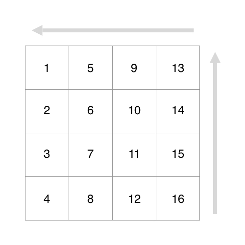
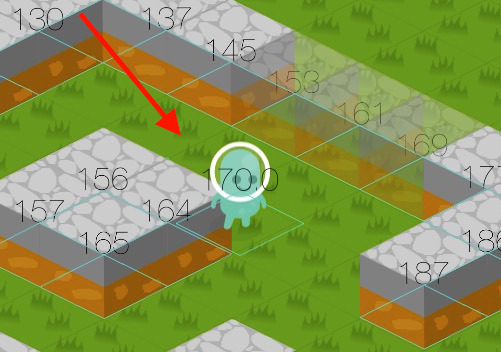

# isometric
Swift 3 SpriteKit Isometric Map

#### Описание:
Персонаж двигаясь по карте взаимодействует с верхними и левыми клетками, эти клетки становятся прозрачными.

zPosition персонажа выставляется из списка клеток с которыми он взаимодействует.

zPosition клеток выставляется в таком порядке, от большего к меньшему

#### Моменты которые надо поправить

1. При распределении zPosition клеткам карты не учитывать их позицию (column, row), то есть что бы порядок начинался так 1,2,3, ...
2. Иправить ошибку координат персонажа. Иногда принимая zPosition верхней клетки мы перекрываем нижнюю

3. Убрать отскок персонажа от клеток
